# **3RD SEMESTER MINI-PROJECT**

## __TERRAFORM SCRIPT__
<li> Terraform is an IAC used to automate the infrastructure. Belows shows the terraform scripts written in different tf files for easy access. 

 

*See the screenshot below - general terraform file*
 
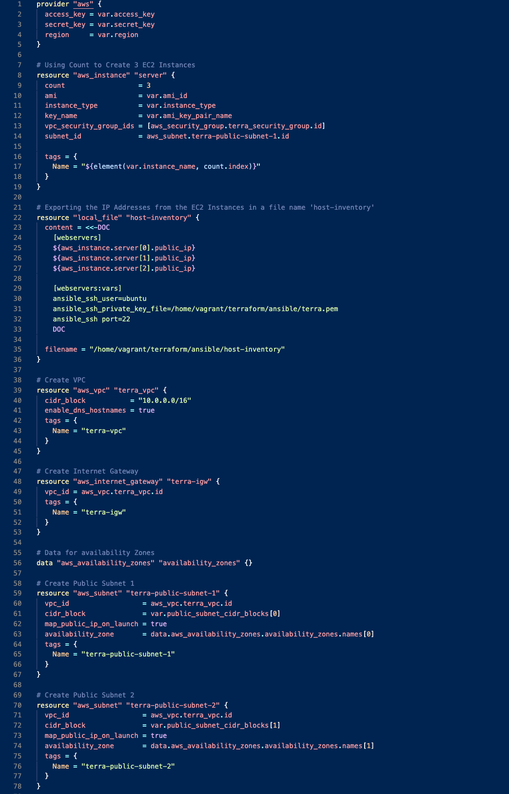
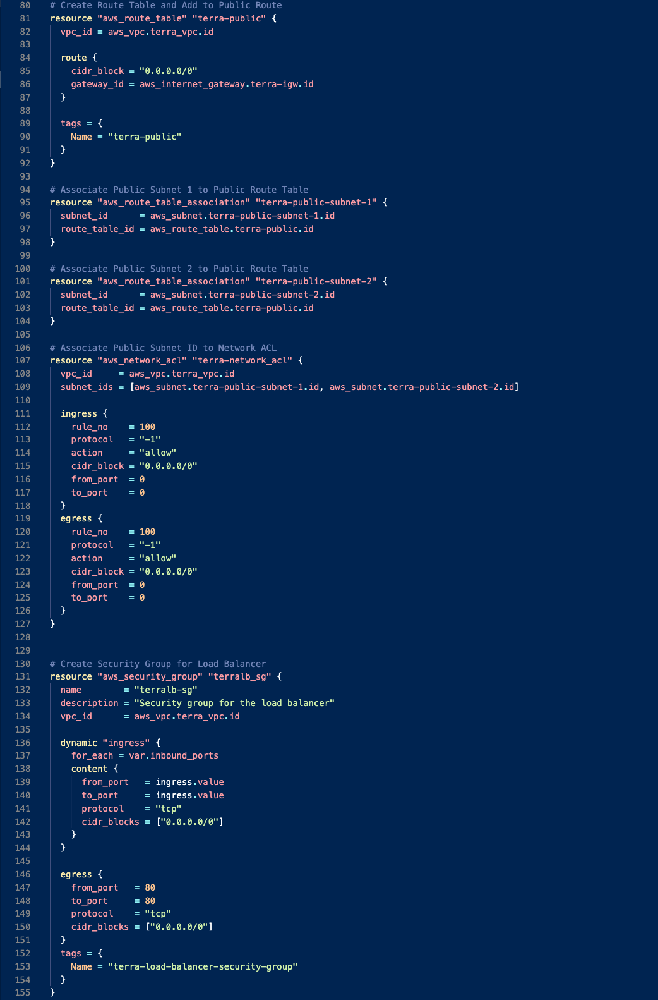
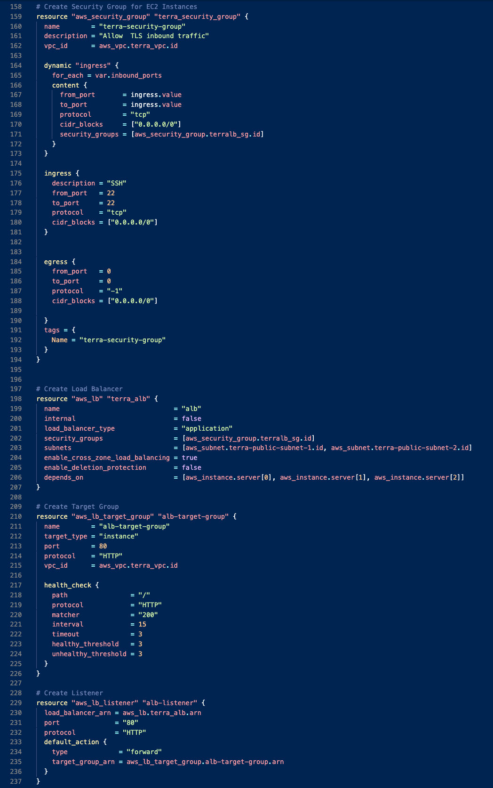
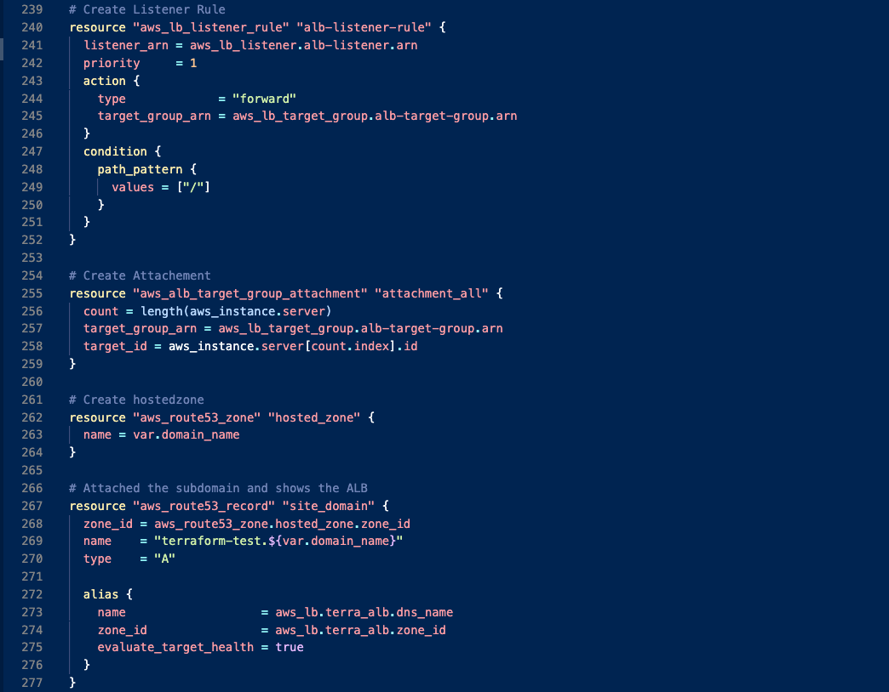
 
 

## __ANSIBLE SCRIPT__
<li> Ansible is an IAC used to automate the configuration of server and is a configuration management tool. Belows shows the general ansible script used to configure the EC2 instances.

 

*See the screenshot below*
 
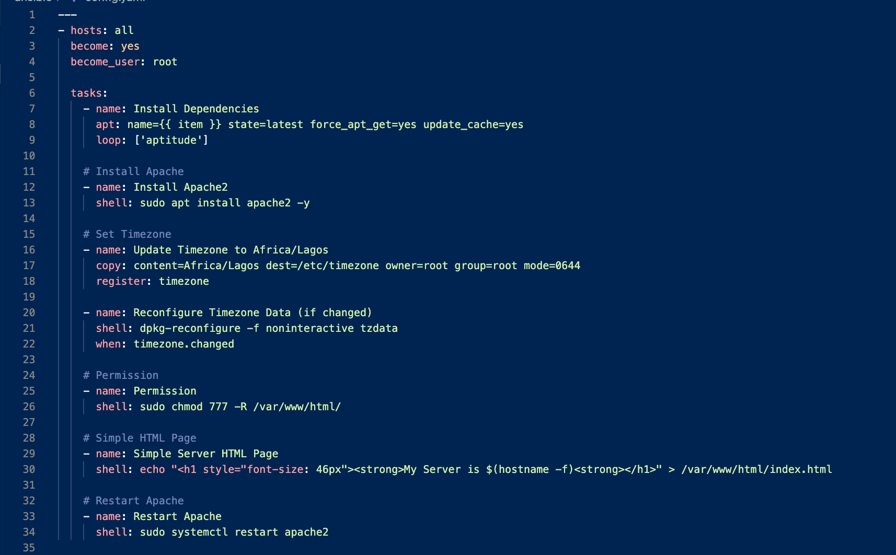
 
 

## __OUTCOME OF TERRAFORM SCRIPT__
 

### __*VPC Created*__
<li> VPC created via terraform and its other associations.

 

*See the screenshot below*
 
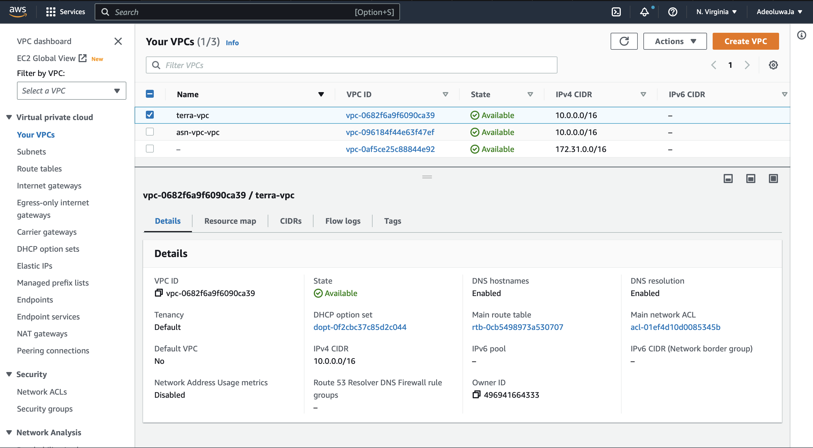
 
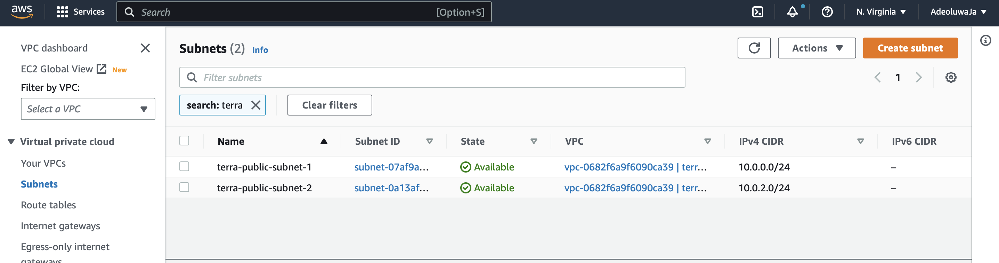
 
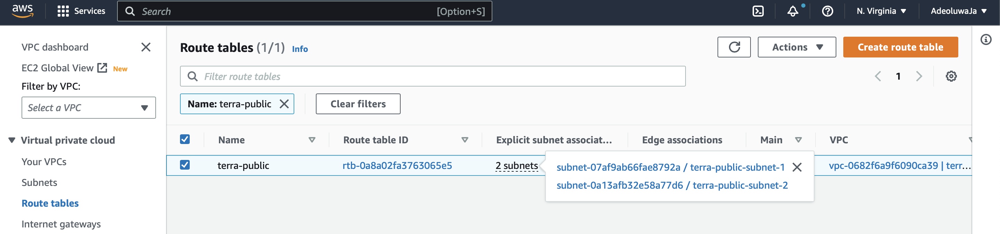
 
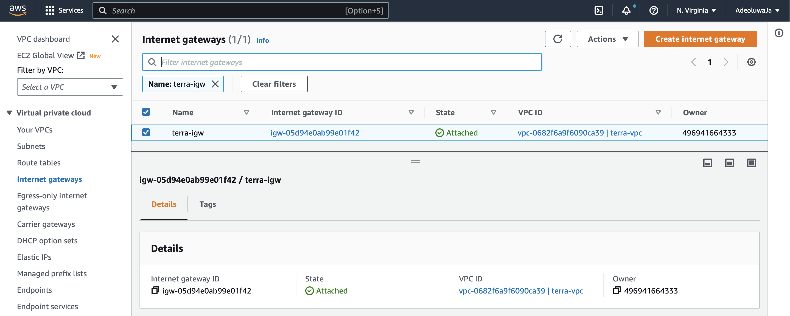
 
 

### __*Security Group Created*__
<li> Security groups for both the EC2 instances and load balancer was created via terraform.

 

*See the screenshot below*
 
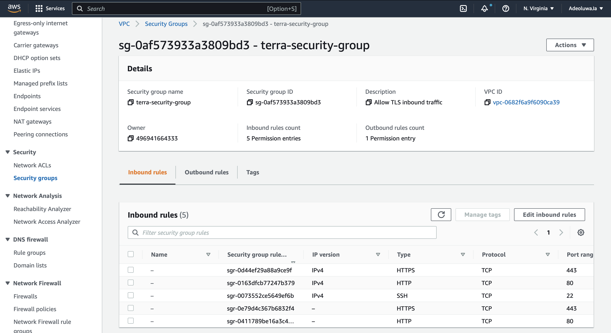
 
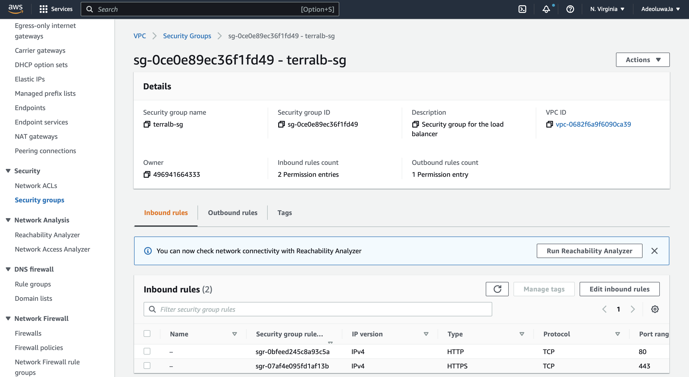
 
 
 

### __*EC2 Instances Created*__
<li> Using count 3 EC2 instances where created and name tags where added for identification purposes. 

 

*See the screenshot below*
 
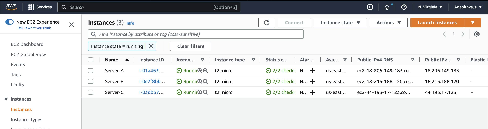
 
 

### __*Load Balancer Created*__
<li> ALB was created by terraform and it displays the content of the EC2 instances and displays content available by the instances one at a time.

 

*See the screenshot below*
 
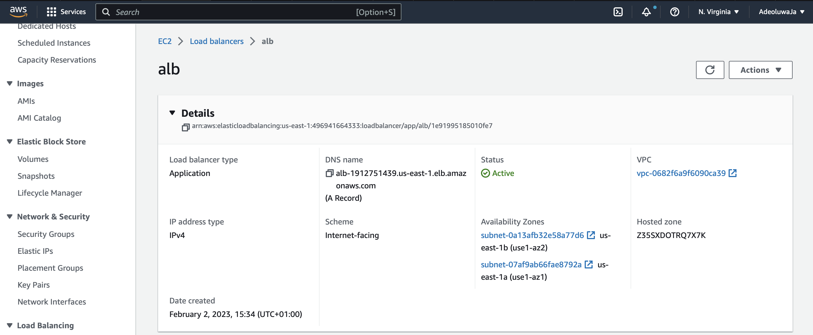
 
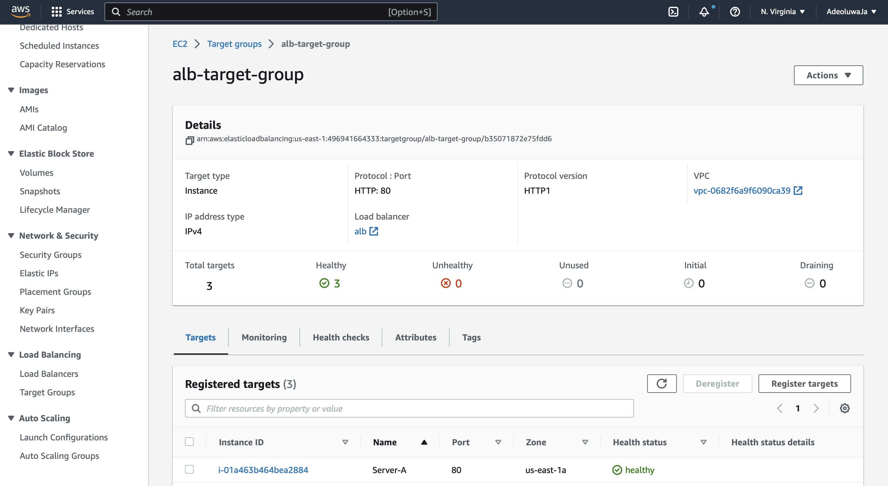
 
 

### __*Route 53 Created*__
<li> This was created with terraform and the content displayed by the ALB will be routed via route 53 to the domain name.

 

*See the screenshot below*
 
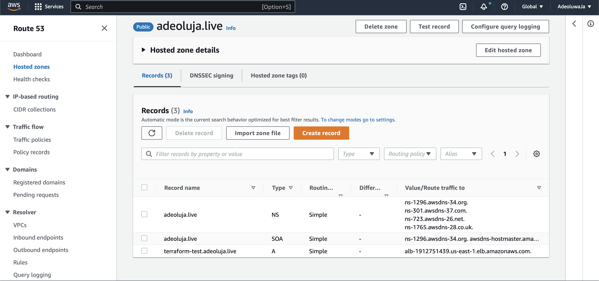
 
 

## __OUTCOME OF ANSIBLE SCRIPT__
 

### __*Install Apache2*__
<li> Apache2 was installed on each of the 3 EC2 Instances.

 

### __*Set Timezone*__
<li> Timezone was updated Africa/Lagos.

 

### __*Simple HTML Page*__
<li> Content of the HTML page was echoed into the /var/www/html/index.html to show the hostname of each of the instances.

 
 

## __DOMAIN__
 

### __*ALB IN DOMAIN NAME - "terraform-test.adeoluja.live"*__

 

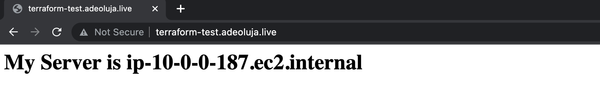
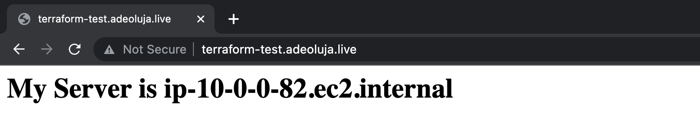
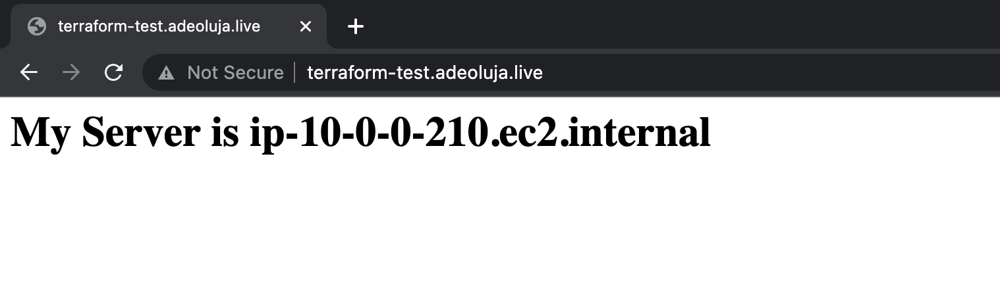

 
 
